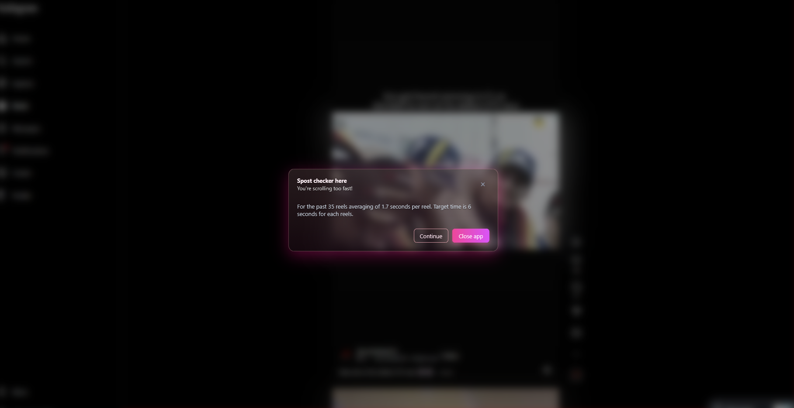

#  Spost  
## A break to your scrolling dopamine  

Spost is a Firefox extension that helps you control your scrolling habits in **Instagram reels**.  
It’s not just another timer app, it detects how much time you spend on each reel and classifies it into categories like too fast, quite fast, or perfect for maintaining a healthy attention span.  

If you scroll too fast in a given interval, Spost will show a popup warning you to slow down, and even add a 5-second delay before you can continue.  
Like other productivity tools, it also includes a session time limit, once reached, the tab will automatically close.  

## Features
[Demo Video](https://hc-cdn.hel1.your-objectstorage.com/s/v3/2f59acf4c02ddca3187506b5e4158d1e9c1e3e99_spost_demo.mp4)
[Demo Video 2](https://hc-cdn.hel1.your-objectstorage.com/s/v3/2a6ea3c1bb9e796829000c246759c81d0939ddf9_spost_demo_2.mp4)

- Reels engagement classification to measure and maintain your attention span  
- Popup warnings when scrolling too fast in a given time.
- Forced tab close when the max session time is exceeded. 

## installation
*note: I use Zen browser here, which based on Firefox.

[installation Video](https://hc-cdn.hel1.your-objectstorage.com/s/v3/101a7d5e1265044ce202206e10388a6709c0e2e7_spost_instalation_guide.mp4)

1. Open up [Spost github page](https://github.com/AmmarSyamil/Spost). 
2. Install zip file inside the **zip_file** folder.
3. Extract that zip file.
4. In Firefox, open page **about:debugging** from the search bar.
5. In menu bar on left, go to **This {browser}** tab.
6. Click the **Temporary Extentions** and click the **Load Temporary Add-on...** button.
7. It will open up file folder and go search for your extracted zip file and load the **manifest.json** file.
8. Done! You can check the console log for "Spost run" to make sure its working. 

## Made With  
- JavaScript  
- HTML & CSS  

## Author  
GitHub: [AmmarSyamil](https://github.com/AmmarSyamil)  

## Extra
You can tweeks the settings in the 'scroll.js' file.

## License  
MIT  
